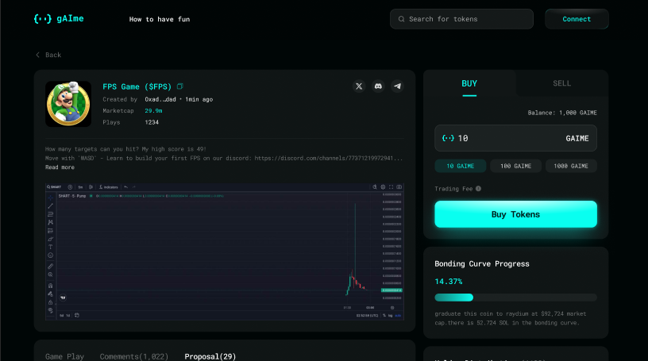
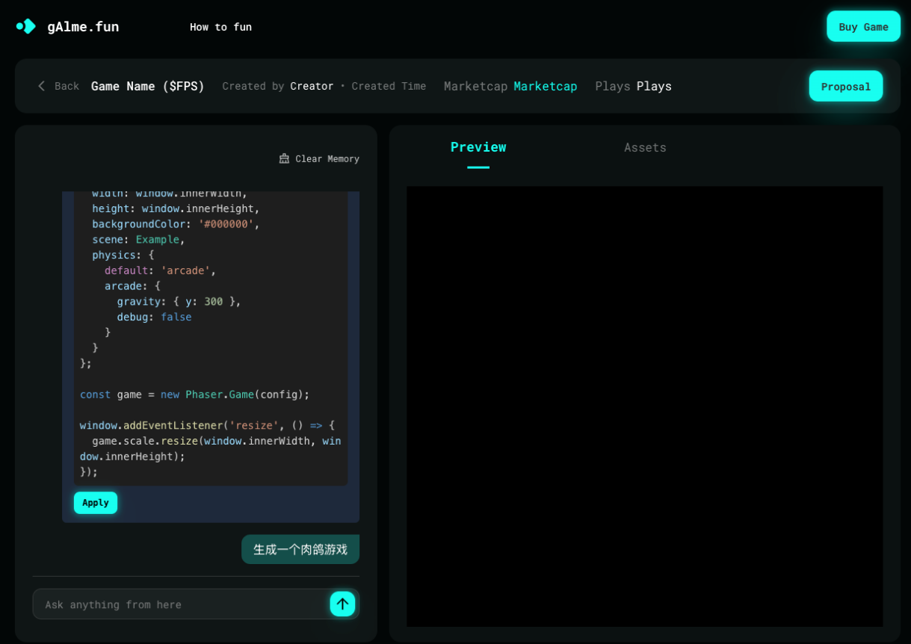

# Gaime - Web3 Meme Token Platform

**🔴 Live Preview**: [https://gaimefi.vercel.app/](https://gaimefi.vercel.app/)

> **⚠️ Important Note**: This is a **Mock Data** version intended for **Portfolio/Job Hunting** purposes. It demonstrates UI/UX and frontend architecture but does not currently connect to a live backend service.


**Gaime** is a Web3 DApp built on **Base**, designed for meme token launching. Inspired by *Pump.fun*, it features an **AI Agent** concept where users can launch tokens managed by AI agents.

This project demonstrates proficiency in **modern frontend architecture**, **Web3 integration**, and **AI agent integration**.

---

## 📸 Screenshots

| Trading Terminal | AI Agent Chat |
|:---:|:---:|
|  |  |
| *Real-time Bonding Curve & K-Line Charts* | *Interactive AI Agent "Awakening"* |

---

## 🌟 Key Features

### 💎 Fair Launch & DeFi Mechanics
*   **Bonding Curve Tokenomics**: Implemented a transparent, math-verified bonding curve for instant liquidity and fair distribution, eliminating rug-pull risks.
*   **Real-Time Trading Engine**: High-frequency data updates using `klinecharts` and WebSocket feeds, delivering a CEX-like trading experience on-chain.
*   **Cross-Chain Compatibility**: Seamlessly supports **Base (EVM)**, managed via unified abstraction layers.

### 🤖 AI Agent Integration ("The Awakening")
*   **Autonomous Agents**: Integrated **Eliza** and **Dify** frameworks to create "living" game characters.
*   **On-Chain Identity**: Agent personalities and ownership rights are tokenized and verified on-chain.
*   **Social & Game Logic**: Agents can trade, chat, and evolve based on community interaction.

### 🏗 Frontend Architecture
*   **React 19 & React Compiler**: Utilizing the latest React features for optimal rendering performance.
*   **Robust State Management**: Scalable store architecture using **Zustand** for sync/async state management.
*   **Type-Safe Web3**: End-to-end type safety with **TypeScript**, **Wagmi v2**, and **Viem**.
*   **Seamless Onboarding**: **Privy** integration for frictionless social logins (Email, Twitter) + standard Wallet Connect.

---

## 🛠️ Tech Stack

### Frontend Core
*   **Framework**: React 19 (Craco Configured)
*   **Language**: TypeScript 5.0+
*   **State**: Zustand, TanStack Query v5
*   **Routing**: React Router v6
*   **Build Tool**: Webpack 5 (via Craco)

### Web3 Integration
*   **EVM**: Wagmi v2, Viem, RainbowKit, Ethers.js v6
*   **Auth**: Privy SDK
*   **Data Indexing**: Alchemy SDK, The Graph (Integration ready)

### UI/UX & Visualization
*   **Styling**: Tailwind CSS, Material UI, Emotion
*   **Charts**: klinecharts (Pro-grade financial charts), ECharts
*   **Animation**: GSAP, LibPAG
*   **Editor**: MDXEditor


---

## ⚡ Getting Started

### Prerequisites
*   Node.js v18+
*   pnpm (recommended) or yarn

### Installation

1.  **Clone the repository**
    ```bash
    git clone https://github.com/your-username/gaime-web.git
    cd gaime-web
    ```

2.  **Install dependencies**
    ```bash
    pnpm install
    ```

3.  **Environment Setup**
    ```bash
    cp .env.example .env.development
    # Fill in REACT_APP_PRIVY_APP_ID, REACT_APP_ALCHEMY_API_KEY, etc.
    ```

4.  **Run Development Server**
    ```bash
    pnpm start
    ```

---

## 👨‍💻 Author

**Developed by [Corn]**

I am a **Senior Web3 Frontend Engineer** with a passion for building high-performance, user-centric decentralized applications. I specialize in bridging the gap between complex blockchain logic and intuitive user experiences.

*   **Expertise**: React, TypeScript, EVM, DeFi Protocols, AI Agents.

[](mailto:ujcxiigmcjx@gmail.com)

---

## 📄 License

This project is licensed under the MIT License - see the [LICENSE](LICENSE) file for details.
